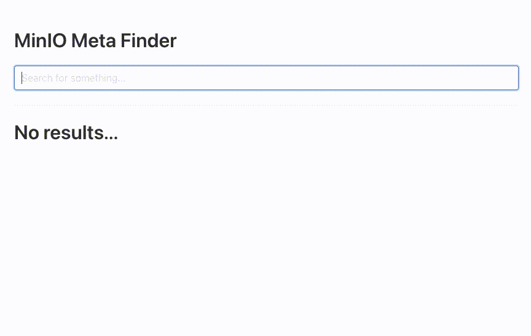

# test-minio-metadata

A simple example of how to use MinIO metadata to search for files in a bucket using Go

## :rocket: How to run

First, start your [MinIO](https://min.io/download#), for example, using [docker](https://www.docker.com/get-started):

```bash
docker run --rm -p 9000:9000 minio/minio server /data
```

Get the external modules:

```bash
go mod download
```

Then, run the program:

```bash
go run ./...
```

As a result, you will have the file names of the object that meet the specifications required by research, using only the User Metadata and User Tags inserted during the upload. Try the example locally at the following url: [preview](http://localhost:9009)

The result should be like the following:


